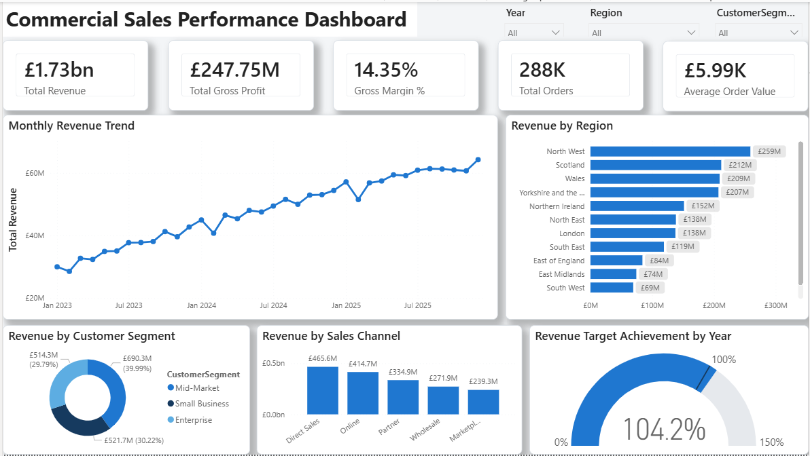
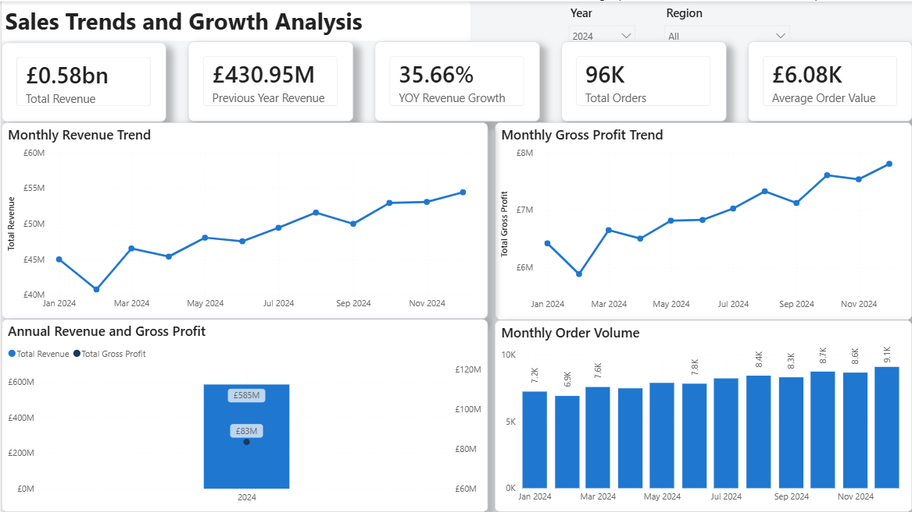
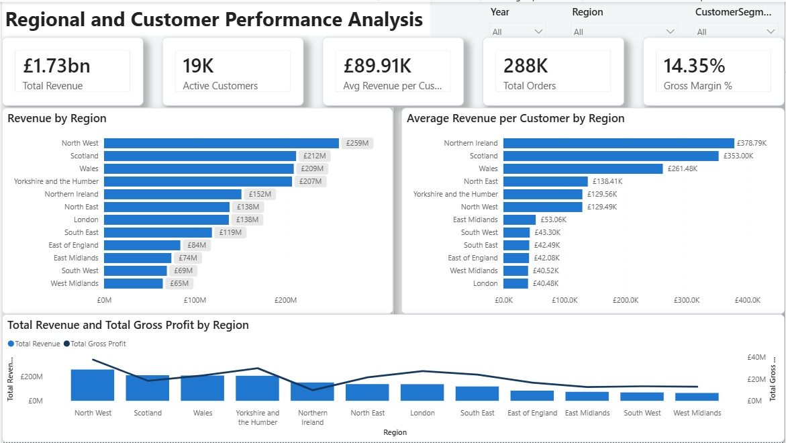
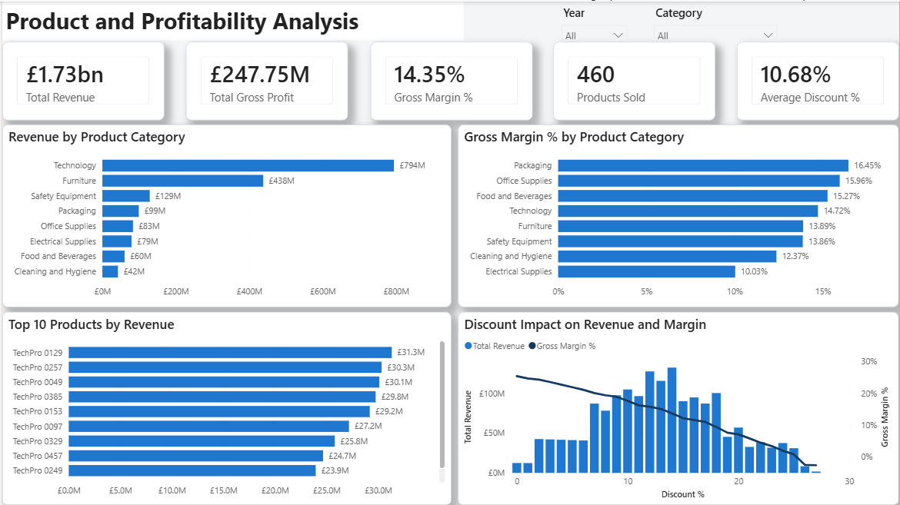
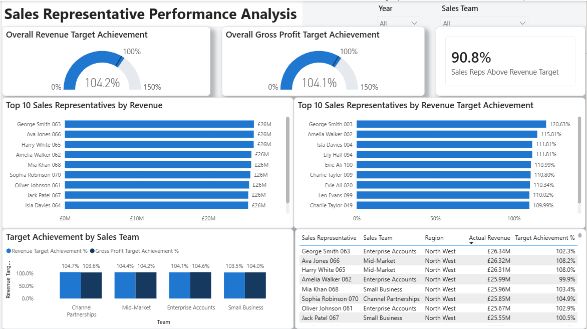
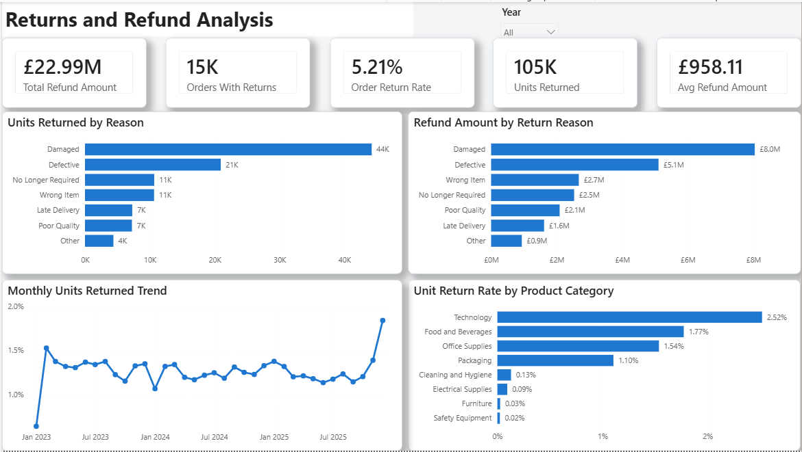
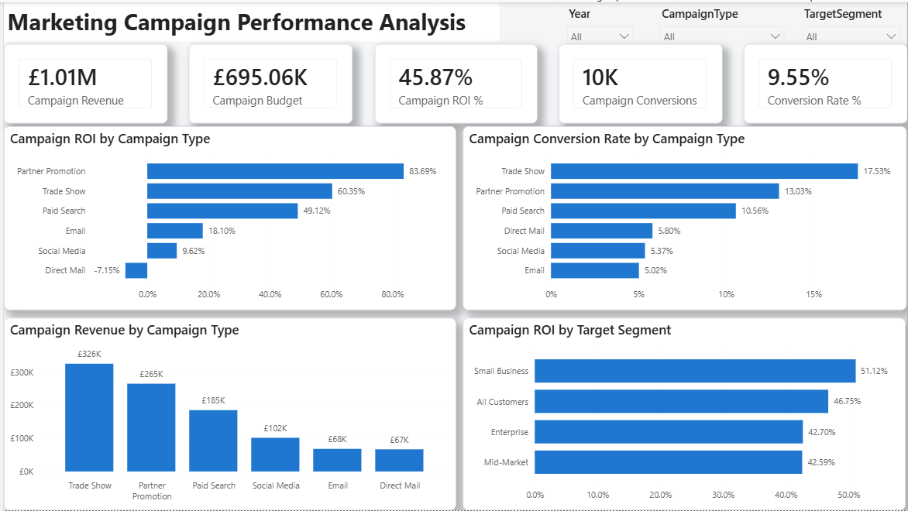

# SQL Commercial Sales Performance Analysis

## Project Overview

This project demonstrates an end-to-end commercial analytics workflow using Microsoft SQL Server and Power BI.

A purpose-built synthetic UK sales database was created to analyse customer behaviour, product performance, regional sales, profitability, sales representative achievement, returns and marketing campaign effectiveness.

The final database contains approximately:

* 20,000 customers
* 500 products
* 120 sales representatives
* 300,000 orders
* 879,000 order-item records
* 24,000 return records
* 100,000 campaign responses
* 3,420 monthly sales-target records

The project focuses on using SQL to transform large transactional data into clear commercial insights and decision-ready outputs. Reporting-ready SQL views were then connected to Power BI to build a fully interactive commercial performance dashboard.

> This project uses synthetic data created specifically for portfolio purposes. It does not contain confidential customer or company information.

---

## Business Problem

A UK commercial distributor wants to understand the key drivers of its sales performance and identify opportunities to improve growth, profitability and operational efficiency.

Management requires insight into:

* Revenue and profit trends
* Regional performance
* Customer value and concentration
* Product and category profitability
* Sales representative target achievement
* Discount effectiveness
* Return rates and refund costs
* Marketing campaign conversion and ROI
* Commercial risks and growth opportunities

---

## Tools Used

* Microsoft SQL Server
* SQL Server Management Studio
* Microsoft Power BI
* DAX
* Git and GitHub

---

## Power BI Dashboard

A fully interactive Power BI dashboard was built using reporting-ready SQL views created from the database.

The dashboard provides a commercial performance view across revenue, profitability, regional performance, customer segments, product categories, sales representative achievement, returns and marketing campaign effectiveness.

The Power BI report file is available in the `reports` folder:

```text
reports/Commercial_Sales_Performance_Dashboard_Final.pbix
```

### Dashboard Pages

1. Executive Overview
2. Sales Trends
3. Regional & Customer Performance
4. Product & Profitability
5. Sales Representative Performance
6. Returns Analysis
7. Marketing Campaign Performance

### Dashboard Screenshots

#### 1. Executive Overview



#### 2. Sales Trends



#### 3. Regional & Customer Performance



#### 4. Product & Profitability



#### 5. Sales Representative Performance



#### 6. Returns Analysis



#### 7. Marketing Campaign Performance



---

## SQL Skills Demonstrated

* Relational database design
* Primary and foreign keys
* Validation constraints
* Index creation
* Multi-table joins
* Common table expressions
* Window functions
* `ROW_NUMBER`
* `DENSE_RANK`
* `LAG`
* `PERCENT_RANK`
* Conditional aggregation
* Date analysis
* Customer segmentation
* Revenue and profitability calculations
* Target-versus-actual analysis
* Data-quality validation
* Synthetic data generation
* Query performance optimisation
* Creation of reporting-ready SQL views for Power BI

---

## Power BI Skills Demonstrated

* SQL Server connection in Power BI
* Data modelling using fact and dimension-style views
* Calendar table creation
* Relationship management
* DAX measure creation
* KPI card design
* Trend analysis
* Target achievement analysis
* Return-rate analysis
* Marketing ROI analysis
* Interactive slicers
* Report page design
* Dashboard theme customisation
* Executive-level dashboard storytelling

---

## Database Structure

The database contains nine connected tables:

| Table                       | Purpose                                                          |
| --------------------------- | ---------------------------------------------------------------- |
| `Customers`                 | Customer segment, industry, location and acquisition information |
| `Products`                  | Product category, brand, cost and selling-price information      |
| `SalesRepresentatives`      | Sales team, region, manager and employment information           |
| `SalesTargets`              | Monthly revenue, gross-profit and new-customer targets           |
| `Orders`                    | Order date, customer, representative, channel and status         |
| `OrderItems`                | Product-level quantity, selling price, cost and discount         |
| `Returns`                   | Returned quantities, reasons, status and refund amount           |
| `MarketingCampaigns`        | Campaign type, budget, dates and target segment                  |
| `CustomerCampaignResponses` | Engagement, conversion and attributed revenue                    |

---

## Project Structure

```text
sql-commercial-sales-performance-analysis
│
├── sql
│   ├── 01_schema
│   │   ├── 01_create_database.sql
│   │   ├── 02_create_tables.sql
│   │   └── 03_create_indexes.sql
│   │
│   ├── 02_data_generation
│   │   ├── 01_generate_products.sql
│   │   ├── 02_generate_sales_representatives.sql
│   │   ├── 03_generate_customers.sql
│   │   ├── 04_generate_marketing_campaigns.sql
│   │   ├── 05_generate_orders.sql
│   │   ├── 06_generate_order_items.sql
│   │   ├── 07_generate_sales_targets.sql
│   │   ├── 08_generate_returns.sql
│   │   └── 09_generate_campaign_responses.sql
│   │
│   ├── 03_data_quality
│   │   └── 01_data_quality_audit.sql
│   │
│   ├── 04_analysis
│   │   ├── 01_business_overview.sql
│   │   ├── 02_monthly_sales_trends.sql
│   │   ├── 03_regional_performance.sql
│   │   ├── 04_customer_analysis.sql
│   │   ├── 05_product_profitability.sql
│   │   ├── 06_sales_rep_performance.sql
│   │   ├── 07_returns_analysis.sql
│   │   ├── 08_marketing_campaign_analysis.sql
│   │   └── 09_executive_insights.sql
│   │
│   └── 05_power_bi_views
│       └── 01_create_power_bi_views.sql
│
├── data
├── images
│   ├── 01_executive_overview.png
│   ├── 02_sales_trends.png
│   ├── 03_regional_customer_performance.png
│   ├── 04_product_profitability.png
│   ├── 05_sales_rep_performance.png
│   ├── 06_returns_analysis.png
│   └── 07_marketing_campaign_performance.png
│
├── reports
│   └── Commercial_Sales_Performance_Dashboard_Final.pbix
│
├── .gitignore
├── LICENSE
└── README.md
```

---

## Analysis Areas

The SQL analysis layer is organised into nine business areas:

| Analysis File                        | Focus Area                                               |
| ------------------------------------ | -------------------------------------------------------- |
| `01_business_overview.sql`           | Overall revenue, profit, orders and customer performance |
| `02_monthly_sales_trends.sql`        | Monthly and yearly revenue trends                        |
| `03_regional_performance.sql`        | Regional revenue and profit performance                  |
| `04_customer_analysis.sql`           | Customer segmentation and value analysis                 |
| `05_product_profitability.sql`       | Product, category and margin performance                 |
| `06_sales_rep_performance.sql`       | Sales representative target achievement                  |
| `07_returns_analysis.sql`            | Return rates, refund cost and return reasons             |
| `08_marketing_campaign_analysis.sql` | Campaign conversion, revenue and ROI                     |
| `09_executive_insights.sql`          | Summary-level commercial findings                        |

---

## Power BI Reporting Views

The Power BI dashboard was built from dedicated SQL views rather than raw tables. This keeps the reporting layer clean and reduces the need for complex transformations inside Power BI.

The main Power BI views include:

| View                            | Purpose                                                              |
| ------------------------------- | -------------------------------------------------------------------- |
| `vw_PowerBI_Sales`              | Sales, product, customer, representative and channel-level reporting |
| `vw_PowerBI_SalesTargets`       | Sales target and actual performance reporting                        |
| `vw_PowerBI_Returns`            | Returns, refund and return-rate analysis                             |
| `vw_PowerBI_MarketingCampaigns` | Campaign response, conversion and ROI analysis                       |
| `vw_PowerBI_Customers`          | Customer-level reporting and segmentation                            |

---

## Key Dashboard Insights

The Power BI dashboard highlights several commercial findings:

* Total revenue reached approximately £1.73bn across the synthetic dataset.
* Gross profit reached approximately £247.75m, with an overall gross margin of around 14.35%.
* Revenue performance exceeded target, with overall revenue target achievement of around 104.2%.
* Sales representative performance was strong, with around 90.8% of representatives above revenue target.
* Technology was the leading product category by revenue, while margin performance varied across categories.
* Return analysis showed damaged items as the largest return reason by both units returned and refund amount.
* Marketing campaign performance varied significantly, with Partner Promotion showing the highest ROI and Direct Mail producing negative ROI.
* Discount analysis showed that revenue can increase at moderate discount levels, but margin declines as discounting becomes heavier.

---

## How to Use This Project

### 1. Create the Database

Run the scripts in the `sql/01_schema` folder in order:

```text
01_create_database.sql
02_create_tables.sql
03_create_indexes.sql
```

### 2. Generate Synthetic Data

Run the scripts in the `sql/02_data_generation` folder in order:

```text
01_generate_products.sql
02_generate_sales_representatives.sql
03_generate_customers.sql
04_generate_marketing_campaigns.sql
05_generate_orders.sql
06_generate_order_items.sql
07_generate_sales_targets.sql
08_generate_returns.sql
09_generate_campaign_responses.sql
```

### 3. Run Data Quality Checks

Run:

```text
sql/03_data_quality/01_data_quality_audit.sql
```

### 4. Run SQL Analysis Queries

Use the files in:

```text
sql/04_analysis
```

### 5. Create Power BI Views

Run:

```text
sql/05_power_bi_views/01_create_power_bi_views.sql
```

### 6. Open the Power BI Dashboard

Open the Power BI report file:

```text
reports/Commercial_Sales_Performance_Dashboard_Final.pbix
```

---

## Data Note

The dataset is fully synthetic and was created for portfolio and learning purposes.

It is designed to reflect realistic commercial analytics scenarios, including revenue growth, customer segmentation, regional performance, sales targets, returns and marketing campaigns. However, it does not represent any real company, customer base or confidential business data.

---

## Project Outcome

This project demonstrates the ability to design a relational database, generate structured synthetic business data, validate data quality, write analytical SQL queries and build an interactive Power BI dashboard for commercial decision-making.

It reflects an end-to-end business analytics workflow from database creation to executive reporting.
